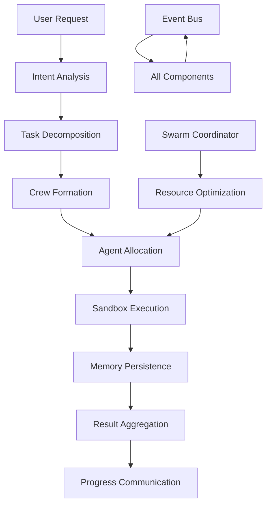
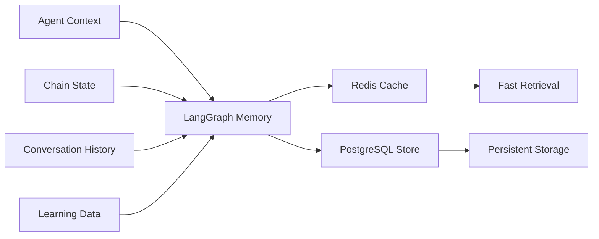

# 🏗️ AgentsMCP Agentic Architecture
*Technical architecture design for enhanced agentic framework integration*

## 🎯 Architecture Overview

AgentsMCP's enhanced architecture integrates proven agentic patterns from LangGraph, AutoGen, CrewAI, MetaGPT, and BeeAI while maintaining backward compatibility and zero-configuration philosophy. The architecture follows a layered approach with clear separation of concerns and event-driven communication.

## 🌟 Core Design Principles

1. **Backward Compatibility** - Existing APIs remain functional during transition
2. **Event-Driven Architecture** - Async communication reduces bottlenecks
3. **Secure by Default** - Sandboxed execution for all untrusted code
4. **Incremental Adoption** - Feature flags enable gradual rollout
5. **Scalable Design** - Horizontal scaling with minimal configuration
6. **Zero Configuration** - Complex capabilities hidden behind simple interfaces

## 🏛️ Five-Layer Architecture

```
┌─────────────────────────────────────────────────────────────────┐
│                    🎨 Presentation Layer                        │
│  Revolutionary UI • Progress Communication • User Experience     │
└─────────────────────┬───────────────────────────────────────────┘
                      │
┌─────────────────────▼───────────────────────────────────────────┐
│                 🧠 Intelligence Layer                           │
│  BeeAI Swarm • Symphony Conductor • Consciousness Monitoring    │
└─────────────────────┬───────────────────────────────────────────┘
                      │
┌─────────────────────▼───────────────────────────────────────────┐
│                🔧 Development Layer                             │
│  MetaGPT Workflows • CI/CD Integration • Artifact Management    │
└─────────────────────┬───────────────────────────────────────────┘
                      │
┌─────────────────────▼───────────────────────────────────────────┐
│                🎭 Coordination Layer                            │
│  CrewAI Roles • Event Bus • Multi-Agent Conversations          │
└─────────────────────┬───────────────────────────────────────────┘
                      │
┌─────────────────────▼───────────────────────────────────────────┐
│                ⚡ Execution Layer                               │
│  AutoGen Sandbox • LangGraph Memory • OpenRouter.ai + Ollama   │
└─────────────────────────────────────────────────────────────────┘
```

## 📦 Component Architecture

### Layer 1: Execution Layer (Foundation)

#### LangGraph Memory System
```typescript
interface MemoryProvider {
  // Persistent context management
  storeContext(agentId: string, context: AgentContext): Promise<void>
  retrieveContext(agentId: string): Promise<AgentContext | null>
  
  // Chain composition support
  createChain(chainSpec: ChainSpecification): Promise<Chain>
  executeChain(chainId: string, inputs: ChainInputs): Promise<ChainResult>
  
  // Event-driven state management
  subscribeToStateChanges(callback: StateChangeCallback): void
}
```

**Technical Implementation:**
- **Backend**: Redis Cluster (hot data) + PostgreSQL (persistent storage)
- **Serialization**: JSON with schema validation
- **Performance**: <100ms context retrieval, versioned state
- **Integration**: Extends existing ContextIntelligenceEngine

#### AutoGen Sandbox Environment
```typescript
interface SandboxExecutor {
  // Secure code execution
  executeCode(code: string, language: string, limits: ResourceLimits): Promise<ExecutionResult>
  
  // Multi-agent conversation support
  createConversation(participants: AgentRole[]): Promise<ConversationId>
  sendMessage(conversationId: ConversationId, message: Message): Promise<void>
  
  // Security and monitoring
  getAuditLog(sandboxId: string): Promise<AuditEntry[]>
  enforceSecurityPolicy(policy: SecurityPolicy): void
}
```

**Technical Implementation:**
- **Containerization**: Docker with resource limits (CPU, memory, network)
- **Security**: AppArmor/SELinux profiles, network isolation
- **Performance**: Pre-warmed containers, <120ms overhead
- **Integration**: Wraps AgentWorker execution pipeline

#### Enhanced Model Management
```typescript
interface ModelOrchestrator {
  // OpenRouter.ai integration
  selectOptimalModel(task: TaskDescription): Promise<ModelSelection>
  
  // Ollama hybrid support
  routeToProvider(request: ModelRequest): Promise<ModelResponse>
  
  // Cost and performance optimization
  trackUsageMetrics(modelId: string, metrics: UsageMetrics): void
  optimizeForCost(budget: CostBudget): ModelStrategy
}
```

### Layer 2: Coordination Layer (Communication)

#### Event-Driven Orchestration Engine
```typescript
interface EventOrchestrator {
  // Kafka-based event bus
  publishEvent(event: AgentEvent): Promise<void>
  subscribeToEvents(eventType: EventType, handler: EventHandler): void
  
  // Chain orchestration
  orchestrateChain(chain: ChainDefinition): Promise<ChainExecution>
  
  // Real-time coordination
  coordinateAgents(agents: Agent[], task: Task): Promise<CoordinationResult>
}
```

**Technical Implementation:**
- **Event Bus**: Apache Kafka with high availability (3+ brokers)
- **Event Schema**: Avro schemas with evolution support
- **Performance**: <30ms event processing, guaranteed delivery
- **Integration**: Replaces synchronous MessageQueue over time

#### CrewAI Role Management
```typescript
interface CrewManager {
  // Role-based coordination
  createCrew(roles: RoleDefinition[]): Promise<Crew>
  assignTask(crewId: string, task: Task): Promise<TaskAssignment>
  
  // Hierarchical delegation
  delegateToSubCrew(task: Task, parentCrew: Crew): Promise<SubCrewAssignment>
  
  // Performance monitoring
  getCrewMetrics(crewId: string): Promise<CrewPerformanceMetrics>
  optimizeCrewComposition(metrics: PerformanceHistory): Promise<OptimizationSuggestions>
}
```

**Role Templates:**
- **Researcher**: Information gathering and analysis
- **Analyst**: Data processing and insights generation
- **Planner**: Strategy formulation and task decomposition
- **Engineer**: Implementation and technical execution
- **Tester**: Quality assurance and validation
- **Supervisor**: Coordination and decision making

### Layer 3: Development Layer (Automation)

#### MetaGPT Workflow Engine
```typescript
interface DevWorkflowEngine {
  // Software development roles
  createProject(requirements: ProjectRequirements): Promise<Project>
  generateArtifacts(project: Project): Promise<GeneratedArtifacts>
  
  // CI/CD integration
  createPipeline(project: Project): Promise<CIPipeline>
  executePipeline(pipelineId: string): Promise<PipelineResult>
  
  // Code review automation
  reviewCode(codeChanges: CodeDiff): Promise<ReviewResult>
  enforceQualityGates(project: Project): Promise<QualityReport>
}
```

**Supported Workflows:**
1. **Requirements Analysis** → **Architecture Design** → **Implementation** → **Testing** → **Deployment**
2. **Bug Report** → **Root Cause Analysis** → **Fix Implementation** → **Regression Testing**
3. **Feature Request** → **Design Review** → **Development** → **Integration Testing** → **Release**

#### Artifact Management System
```typescript
interface ArtifactManager {
  // Version-controlled artifacts
  storeArtifact(artifact: Artifact): Promise<ArtifactId>
  retrieveArtifact(artifactId: ArtifactId, version?: string): Promise<Artifact>
  
  // Artifact relationships
  linkArtifacts(parentId: ArtifactId, childId: ArtifactId): Promise<void>
  getArtifactDependencies(artifactId: ArtifactId): Promise<ArtifactId[]>
  
  // Search and discovery
  searchArtifacts(query: ArtifactQuery): Promise<ArtifactSearchResult[]>
}
```

### Layer 4: Intelligence Layer (Adaptation)

#### BeeAI Swarm Coordinator
```typescript
interface SwarmCoordinator {
  // Distributed task allocation
  allocateTask(task: Task): Promise<TaskAllocation>
  optimizeResourceUsage(): Promise<OptimizationResult>
  
  // Emergent behaviors
  enableEmergentCoordination(swarmConfig: SwarmConfiguration): Promise<void>
  monitorSwarmHealth(): Promise<SwarmHealthMetrics>
  
  // Fault tolerance
  handleNodeFailure(nodeId: string): Promise<FailoverResult>
  rebalanceLoad(): Promise<RebalanceResult>
}
```

**Swarm Algorithms:**
- **Particle Swarm Optimization** for resource allocation
- **Ant Colony Optimization** for task routing
- **Consensus Algorithms** for distributed decision making
- **Gossip Protocols** for information dissemination

#### Symphony Mode Conductor
```typescript
interface SymphonyConductor {
  // Musical harmony coordination
  coordinateAgents(agents: Agent[]): Promise<SymphonyPerformance>
  measureHarmony(performance: SymphonyPerformance): Promise<HarmonyScore>
  
  // Consciousness management
  monitorConsciousness(agent: Agent): Promise<ConsciousnessLevel>
  enhanceCollectiveIntelligence(): Promise<CollectiveIQMetrics>
  
  // Real-time synchronization
  synchronizeAgents(tempo: number): Promise<SynchronizationResult>
}
```

### Layer 5: Presentation Layer (User Experience)

#### Revolutionary User Interface
```typescript
interface UserExperienceEngine {
  // Glassmorphism design system
  renderInterface(context: UIContext): Promise<RenderedInterface>
  
  // 3D agent visualization
  visualizeAgentNetwork(agents: Agent[]): Promise<NetworkVisualization>
  
  // Progress communication
  communicateProgress(task: Task, progress: Progress): Promise<void>
  hideComplexity(operation: ComplexOperation): Promise<SimplifiedUI>
}
```

## 🔄 Data Flow Architecture

### Event-Driven Communication Flow


### Memory and State Management


## 🔧 Integration Patterns

### Backward Compatibility Strategy
```typescript
// Legacy API wrapper maintains existing functionality
class LegacyAPIWrapper {
  // Existing MessageQueue interface
  async sendTask(task: Task): Promise<TaskResult> {
    // Internally uses new event-driven system
    return await this.eventOrchestrator.publishTaskEvent(task)
  }
  
  // Maintains existing response format
  async getAgentStatus(agentId: string): Promise<LegacyAgentStatus> {
    const status = await this.crewManager.getAgentStatus(agentId)
    return this.convertToLegacyFormat(status)
  }
}
```

### Feature Flag Implementation
```typescript
interface FeatureFlags {
  enableLangGraphMemory: boolean
  enableAutoGenSandbox: boolean
  enableCrewAIRoles: boolean
  enableMetaGPTWorkflows: boolean
  enableBeeAISwarm: boolean
  enableEventDrivenOrchestration: boolean
}

// Gradual rollout with fallback
class FeatureGatedOrchestrator {
  async processTask(task: Task): Promise<TaskResult> {
    if (this.flags.enableEventDrivenOrchestration) {
      return await this.eventOrchestrator.processTask(task)
    } else {
      return await this.legacyOrchestrator.processTask(task)
    }
  }
}
```

## 📊 Performance Characteristics

### Scalability Targets
| Component | Current | Target | Scaling Strategy |
|-----------|---------|--------|------------------|
| **Concurrent Agents** | 100 | 1,000+ | Horizontal pod scaling |
| **Events/Second** | N/A | 10,000+ | Kafka partitioning |
| **Memory Queries** | N/A | 100,000+ | Redis clustering |
| **Sandbox Containers** | N/A | 500+ | Container orchestration |
| **Response Latency** | 500ms | 150ms | Event-driven optimization |

### Resource Requirements
| Layer | CPU Cores | Memory (GB) | Storage (GB) | Network (Gbps) |
|-------|-----------|-------------|--------------|----------------|
| **Execution** | 8-16 | 32-64 | 500-1000 | 1-10 |
| **Coordination** | 4-8 | 16-32 | 100-500 | 1-10 |
| **Development** | 2-4 | 8-16 | 100-250 | 0.1-1 |
| **Intelligence** | 16-32 | 64-128 | 250-500 | 1-10 |
| **Presentation** | 2-4 | 4-8 | 50-100 | 0.1-1 |

## 🔐 Security Architecture

### Multi-Layer Security Model
```typescript
interface SecurityStack {
  // Network security
  networkPolicies: NetworkSecurityPolicy[]
  tlsEncryption: TLSConfiguration
  
  // Container security
  sandboxIsolation: ContainerIsolationPolicy
  resourceLimits: ResourceLimitPolicy
  
  // Application security
  authenticationMethods: AuthMethod[]
  authorizationPolicies: AuthzPolicy[]
  
  // Data security
  encryptionAtRest: EncryptionConfig
  encryptionInTransit: EncryptionConfig
  
  // Audit and monitoring
  auditLogging: AuditConfiguration
  securityMonitoring: MonitoringConfiguration
}
```

### Threat Model & Mitigations
| Threat | Risk Level | Mitigation |
|--------|------------|------------|
| **Malicious Code Execution** | High | AutoGen sandbox isolation |
| **Data Exfiltration** | Medium | Network policies, encryption |
| **Resource Exhaustion** | Medium | Resource limits, monitoring |
| **Privilege Escalation** | High | Principle of least privilege |
| **Man-in-the-Middle** | Low | TLS everywhere, certificate pinning |

## 🚀 Deployment Architecture

### Kubernetes-Native Design
```yaml
# Sample deployment configuration
apiVersion: apps/v1
kind: Deployment
metadata:
  name: agentsmcp-orchestrator
spec:
  replicas: 3
  template:
    spec:
      containers:
      - name: orchestrator
        image: agentsmcp/orchestrator:latest
        resources:
          requests:
            memory: "2Gi"
            cpu: "1000m"
          limits:
            memory: "4Gi"
            cpu: "2000m"
        env:
        - name: ENABLE_LANGGRAPH_MEMORY
          valueFrom:
            configMapKeyRef:
              name: feature-flags
              key: enable-langgraph-memory
```

### Service Mesh Integration
- **Istio/Linkerd** for service-to-service communication
- **mTLS** for secure inter-service communication
- **Circuit breakers** for resilience
- **Distributed tracing** with Jaeger/Zipkin

## 📈 Monitoring & Observability

### Metrics Collection
```typescript
interface ObservabilityStack {
  // Performance metrics
  responseTimeMetrics: LatencyMetrics
  throughputMetrics: ThroughputMetrics
  errorRateMetrics: ErrorRateMetrics
  
  // Business metrics
  agentUtilizationMetrics: UtilizationMetrics
  costOptimizationMetrics: CostMetrics
  userSatisfactionMetrics: SatisfactionMetrics
  
  // System metrics
  resourceUsageMetrics: ResourceMetrics
  systemHealthMetrics: HealthMetrics
  securityEventMetrics: SecurityMetrics
}
```

### Alerting Strategy
| Alert Type | Severity | Response Time | Escalation |
|------------|----------|---------------|------------|
| **Security Incident** | Critical | <5 minutes | Immediate |
| **System Down** | Critical | <5 minutes | Immediate |
| **Performance Degradation** | Warning | <15 minutes | If persists >1hr |
| **Resource Exhaustion** | Warning | <30 minutes | If >80% utilization |
| **Business Metric Anomaly** | Info | <1 hour | Daily review |

---

**Architecture Document Version:** 1.0  
**Last Updated:** August 25, 2025  
**Next Review:** Monthly architecture review  
**Approval Required:** CTO, Security Team, Engineering Leads