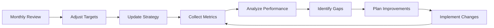

# 📊 AgentsMCP Success Metrics & KPIs
*Comprehensive measurement framework for agentic enhancement success*

## 🎯 Executive Summary

This document defines the key performance indicators (KPIs) and success metrics for AgentsMCP's agentic framework integration. The metrics are organized by implementation phase, business impact, and technical performance to provide comprehensive visibility into the success of the enhanced platform.

## 🏆 Strategic Success Framework

### North Star Metrics
| Metric | Current Baseline | Target | Impact |
|--------|------------------|--------|---------|
| **Platform Adoption Rate** | 100 users | 500+ users | 5x growth through enhanced capabilities |
| **User Satisfaction Score** | 7.5/10 | 9.5/10 | "Magical" user experience achievement |
| **Time to Value** | 5 minutes | 60 seconds | Zero-configuration enhancement |
| **Platform Stickiness** | 60% monthly retention | 90% monthly retention | Advanced agentic capabilities |

---

## 📈 Phase-Based Success Metrics

### Phase 1: Enhanced Foundation (Weeks 1-3)

#### LangGraph Memory Integration Success
| KPI | Measurement Method | Target | Business Impact |
|-----|-------------------|---------|-----------------|
| **Context Restoration Rate** | % of agents successfully restoring context after restart | ≥95% | Improved user experience continuity |
| **Memory Query Latency** | Average time to retrieve agent context | <100ms | Faster agent response times |
| **Context Persistence Reliability** | % of successful context saves | ≥99.9% | Data integrity and user trust |
| **Memory Storage Efficiency** | Storage size reduction through optimization | 30% reduction | Cost optimization |

#### AutoGen Sandbox Security Success
| KPI | Measurement Method | Target | Business Impact |
|-----|-------------------|---------|-----------------|
| **Security Violation Rate** | Number of successful sandbox escapes | 0 violations | Enterprise security compliance |
| **Sandbox Execution Overhead** | Additional latency from containerization | <120ms | Performance optimization |
| **Code Execution Success Rate** | % of successful untrusted code executions | ≥98% | Platform reliability |
| **Audit Trail Completeness** | % of execution events properly logged | 100% | Compliance and debugging |

#### Event-Driven Orchestration Success
| KPI | Measurement Method | Target | Business Impact |
|-----|-------------------|---------|-----------------|
| **Event Processing Latency** | Average time from event publish to consumption | <30ms | Real-time coordination |
| **Event Throughput** | Events processed per second | ≥10,000 EPS | Scalability achievement |
| **Event-Driven Adoption** | % of agent jobs using event processing | ≥80% | Architecture transformation |
| **System Reliability** | Event delivery guarantee rate | ≥99.99% | Platform dependability |

### Phase 2: Revolutionary Intelligence (Weeks 4-6)

#### CrewAI Role Coordination Success
| KPI | Measurement Method | Target | Business Impact |
|-----|-------------------|---------|-----------------|
| **Crew Workflow Adoption** | % of complex tasks using crew coordination | ≥70% | Enhanced task management |
| **Role Specialization Efficiency** | Task completion time improvement with roles | 25% faster | Productivity enhancement |
| **Hierarchical Delegation Success** | % of successful sub-task delegations | ≥90% | Scalable coordination |
| **Crew Performance Optimization** | Improvement in crew task success rates | 20% improvement | Quality enhancement |

#### MetaGPT Development Workflow Success
| KPI | Measurement Method | Target | Business Impact |
|-----|-------------------|---------|-----------------|
| **Pipeline Success Rate** | % of commits passing automated pipeline | ≥90% | Development quality |
| **Automated Artifact Quality** | % of generated artifacts requiring no manual revision | ≥80% | Development efficiency |
| **Development Cycle Time** | Time from requirement to deployment | 50% reduction | Time to market |
| **Code Review Automation** | % of reviews handled by AI without human intervention | ≥70% | Resource optimization |

#### Swarm Intelligence Foundation Success
| KPI | Measurement Method | Target | Business Impact |
|-----|-------------------|---------|-----------------|
| **Cost Optimization Achievement** | Total cost of ownership reduction | ≥15% | Financial impact |
| **Resource Utilization Efficiency** | Improvement in compute resource usage | 20% better utilization | Infrastructure optimization |
| **Fault Tolerance Improvement** | Reduction in system downtime during failures | 50% less downtime | Reliability enhancement |
| **Adaptive Optimization Speed** | Time to optimize resource allocation | <5 minutes | Dynamic efficiency |

### Phase 3: Evolution & Production Scale (Weeks 7-9)

#### Multi-Agent Conversation Success
| KPI | Measurement Method | Target | Business Impact |
|-----|-------------------|---------|-----------------|
| **Conversation Quality Score** | AI-measured conversation productivity | ≥8.5/10 | Enhanced collaboration |
| **Multi-Turn Engagement** | Average conversation turns per task | ≥5 turns | Rich interaction capability |
| **Collaborative Decision Accuracy** | % of correct decisions from group reasoning | ≥95% | Improved outcomes |
| **Conversation Completion Rate** | % of conversations reaching successful resolution | ≥85% | Task completion reliability |

#### Full Event-Driven Architecture Success
| KPI | Measurement Method | Target | Business Impact |
|-----|-------------------|---------|-----------------|
| **Event Throughput Achievement** | Production event processing capacity | ≥95% of target | Scalability validation |
| **Latency Optimization** | Average end-to-end response time | <150ms | Performance excellence |
| **System Scalability** | Concurrent agents supported | ≥1,000 agents | Platform scalability |
| **Multi-Tenant Efficiency** | Resource isolation and performance | 99.9% isolation | Enterprise readiness |

#### Genetic Algorithm Evolution Success
| KPI | Measurement Method | Target | Business Impact |
|-----|-------------------|---------|-----------------|
| **Generational Improvement Rate** | Performance increase per generation | ≥10% improvement | Continuous enhancement |
| **Evolution Convergence Time** | Time to reach optimal performance | <24 hours | Rapid optimization |
| **Diversity Preservation** | Genetic diversity maintenance score | ≥0.7 | Innovation capability |
| **Fitness Evaluation Accuracy** | Correlation between fitness and actual performance | ≥0.9 correlation | Effective selection |

---

## 💼 Business Impact Metrics

### Revenue & Growth Impact
| KPI | Measurement Period | Target | Calculation Method |
|-----|-------------------|---------|-------------------|
| **Customer Acquisition Rate** | Monthly | 50% increase | New customers / Previous month customers |
| **Average Revenue Per User (ARPU)** | Quarterly | 30% increase | Total revenue / Active users |
| **Customer Lifetime Value (CLV)** | Annually | 100% increase | (ARPU × Retention rate) / Churn rate |
| **Net Promoter Score (NPS)** | Quarterly | ≥70 | % Promoters - % Detractors |

### Operational Efficiency Impact
| KPI | Measurement Period | Target | Calculation Method |
|-----|-------------------|---------|-------------------|
| **Support Ticket Reduction** | Monthly | 40% decrease | (Previous tickets - Current tickets) / Previous tickets |
| **Mean Time to Resolution (MTTR)** | Weekly | 50% reduction | Average time to resolve issues |
| **System Uptime** | Monthly | ≥99.9% | (Total time - Downtime) / Total time |
| **Cost per Transaction** | Monthly | 25% reduction | Total costs / Number of transactions |

### Competitive Advantage Metrics
| KPI | Measurement Period | Target | Calculation Method |
|-----|-------------------|---------|-------------------|
| **Feature Uniqueness Score** | Quarterly | ≥8/10 | Expert evaluation vs competitors |
| **Market Share Growth** | Quarterly | 200% increase | AgentsMCP users / Total market users |
| **Technology Innovation Index** | Bi-annually | Top 10% | Industry benchmark comparison |
| **Customer Switching Rate** | Monthly | <2% | Customers leaving / Total customers |

---

## 🔧 Technical Performance Metrics

### Infrastructure Performance
| Category | Metric | Target | Monitoring Tool |
|----------|--------|--------|-----------------|
| **Latency** | P95 Response Time | <200ms | Prometheus + Grafana |
| **Throughput** | Requests per Second | ≥10,000 RPS | Application metrics |
| **Availability** | System Uptime | ≥99.99% | Pingdom + StatusPage |
| **Scalability** | Concurrent Users | ≥10,000 | Load testing tools |

### Security & Compliance Metrics
| Category | Metric | Target | Monitoring Tool |
|----------|--------|--------|-----------------|
| **Security Incidents** | Successful attacks | 0 per month | SIEM systems |
| **Compliance Score** | Audit compliance rate | 100% | Compliance tools |
| **Vulnerability Management** | Mean time to patch | <24 hours | Security scanners |
| **Access Control** | Unauthorized access attempts | 0 successful | Access logs |

### Code Quality Metrics
| Category | Metric | Target | Monitoring Tool |
|----------|--------|--------|-----------------|
| **Test Coverage** | Code coverage percentage | ≥90% | Jest/Pytest coverage |
| **Bug Rate** | Bugs per 1000 lines of code | <0.5 | Bug tracking systems |
| **Code Maintainability** | Maintainability index | ≥80 | SonarQube |
| **Technical Debt Ratio** | Debt ratio percentage | <10% | Code analysis tools |

---

## 📋 Measurement Framework

### Data Collection Strategy
```typescript
interface MetricsCollectionSystem {
  // Real-time metrics
  realTimeMetrics: {
    latency: LatencyCollector
    throughput: ThroughputCollector
    errorRate: ErrorRateCollector
  }
  
  // Business metrics
  businessMetrics: {
    userEngagement: EngagementCollector
    revenueMetrics: RevenueCollector
    customerSatisfaction: SatisfactionCollector
  }
  
  // Technical metrics
  technicalMetrics: {
    systemHealth: HealthCollector
    resourceUtilization: ResourceCollector
    securityEvents: SecurityCollector
  }
}
```

### Reporting Schedule
| Report Type | Frequency | Audience | Content |
|-------------|-----------|----------|---------|
| **Executive Dashboard** | Weekly | C-Suite | North Star metrics, business impact |
| **Engineering Report** | Daily | Engineering Team | Technical performance, issues |
| **Product Analytics** | Bi-weekly | Product Team | User behavior, feature adoption |
| **Security Report** | Monthly | Security Team | Security metrics, compliance |

### Alert Configuration
| Metric Type | Warning Threshold | Critical Threshold | Response Time |
|-------------|-------------------|-------------------|---------------|
| **Response Time** | >150ms P95 | >300ms P95 | <15 minutes |
| **Error Rate** | >1% | >5% | <5 minutes |
| **System Downtime** | >30 seconds | >2 minutes | <2 minutes |
| **Security Events** | Any anomaly | Any breach | <5 minutes |

---

## 🎯 Success Validation Framework

### Phase Gate Reviews
Each phase requires validation against success criteria before proceeding:

#### Phase 1 Gate Review Checklist
- [ ] **Memory Integration**: 95% context restoration achieved
- [ ] **Sandbox Security**: Zero security violations recorded
- [ ] **Event Processing**: 80% adoption with <30ms latency
- [ ] **Performance**: No regression in baseline metrics
- [ ] **User Experience**: No negative user feedback trends

#### Phase 2 Gate Review Checklist
- [ ] **Crew Coordination**: 70% of workflows using crews
- [ ] **Development Automation**: 90% pipeline success rate
- [ ] **Swarm Intelligence**: 15% cost reduction achieved
- [ ] **Quality Gates**: All technical debt within limits
- [ ] **Business Impact**: 20% improvement in key metrics

#### Phase 3 Gate Review Checklist
- [ ] **Conversation Quality**: 8.5/10 quality score achieved
- [ ] **Architecture Scaling**: 1,000+ concurrent agents supported
- [ ] **Evolution Success**: 10% improvement per generation
- [ ] **Production Readiness**: 99.99% availability achieved
- [ ] **Strategic Goals**: All North Star metrics on track

### Continuous Improvement Process


---

## 📊 Dashboard & Visualization

### Executive Dashboard Components
1. **North Star Metrics** - Primary success indicators
2. **Business Impact** - Revenue, growth, and efficiency metrics
3. **Competitive Position** - Market share and innovation metrics
4. **Risk Indicators** - Security, compliance, and operational risks

### Engineering Dashboard Components
1. **System Performance** - Latency, throughput, and availability
2. **Quality Metrics** - Bug rates, test coverage, and technical debt
3. **Deployment Health** - Release success and rollback rates
4. **Resource Utilization** - Infrastructure and cost metrics

### Product Dashboard Components
1. **User Engagement** - Feature adoption and satisfaction
2. **Conversion Metrics** - Trial to paid conversion rates
3. **Retention Analysis** - Churn rates and lifetime value
4. **Feature Performance** - Usage patterns and effectiveness

---

## 🎖️ Success Recognition Framework

### Milestone Celebrations
- **Phase Completion Rewards** - Team recognition for phase gate achievements
- **Innovation Awards** - Recognition for breakthrough implementations
- **Performance Excellence** - Rewards for exceeding target metrics
- **Customer Impact** - Recognition for measurable business value delivery

### Continuous Recognition
- **Weekly Wins** - Celebrate small victories and progress
- **Monthly MVPs** - Most Valuable Performers in metrics achievement
- **Quarterly Innovation** - Breakthrough technical achievements
- **Annual Excellence** - Overall platform success celebration

---

**Metrics Framework Owner:** Product & Engineering Leadership  
**Review Cycle:** Weekly tactical, Monthly strategic, Quarterly comprehensive  
**Last Updated:** August 25, 2025  
**Next Evolution:** Quarterly metrics framework refinement