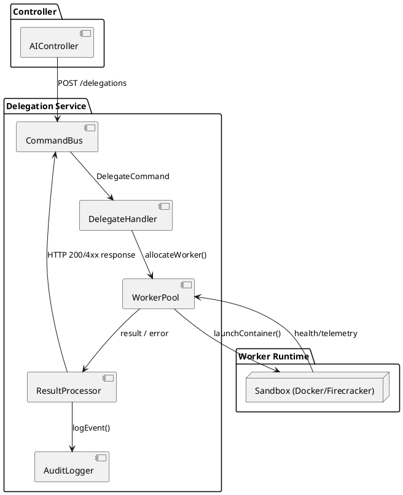
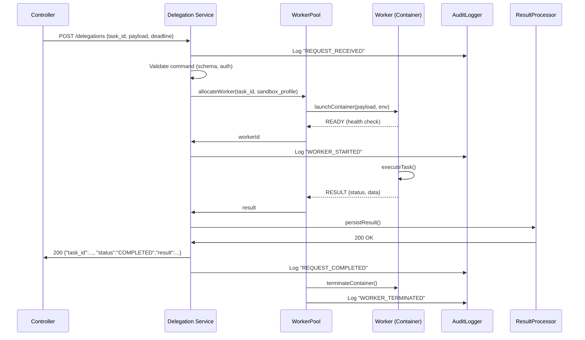
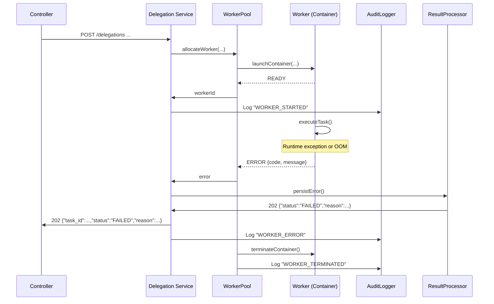
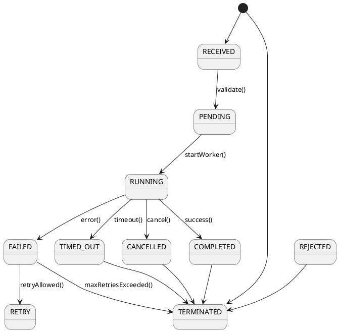

# AgentsMCP Delegation Specification
*Version: 1.0.0* *Last Updated: 2025‑08‑25*  

This document defines the **delegation subsystem** of **AgentsMCP** – the component that lets a primary AI Agent (the *Controller*) spin‑up short‑lived *Worker* agents to perform isolated sub‑tasks.  

It covers:

1. **Delegation Architecture** – command pattern, responsibilities, and component diagram.  
2. **Sequence Diagrams** – request flow, worker lifecycle, and error handling.  
3. **State Management** – worker states, transitions, and cleanup rules.  
4. **Guardrails** – safety mechanisms and user‑confirmation flows.  
5. **Audit Logging** – human‑readable, query‑able logs.  
6. **API Specification** – REST endpoints, payload schemas, and examples.  
7. **Security Model** – authentication, authorization, sandboxing, and rate limiting.  
8. **Implementation Guide** – step‑by‑step instructions for developers.

All sections are written for **production‑ready** implementation and include concrete, unambiguous details.

---

## 1. Delegation Architecture

### 1.1 Overview

```
+----------------+          +----------------+          +-------------------+
|  Controller   |  RPC/HTTP|  Delegation   |  HTTP/GRPC|  Worker (short‑lived) |
|  (AI Agent)   |--------->|  Service (DS) |--------->|  Process (container) |
+----------------+          +----------------+          +-------------------+
          |                         |                           |
          |   1. spawn command      |   2. create worker         |
          |------------------------>|-------------------------->|
          |                         |   3. attach sandbox        |
          |                         |   4. start exec            |
          |                         |<--------------------------|
          |   5. result/telemetry   |   6. finish/cleanup        |
          |<------------------------|<--------------------------|
```

* **Controller** – The primary AI agent that decides a sub‑task should be delegated.  
* **Delegation Service (DS)** – A stateless micro‑service exposing a **Command Bus** (`DelegateCommand`) and managing the worker pool, sandboxing, and audit logging.  
* **Worker** – An isolated process (Docker container or Firecracker VM) that executes the delegated request. Workers live **≤ 30 seconds** (configurable) and are destroyed immediately after returning a result or hitting a timeout.

### 1.2 Command Pattern

| Component | Responsibility |
|-----------|----------------|
| `DelegateCommand` | Immutable DTO that contains: <br>`task_id` (UUID), `payload` (JSON), `deadline` (ISO‑8601), `sandbox_profile` (enum), `caller_context` (metadata). |
| `CommandHandler` (`DelegateHandler`) | Validates the command, selects a worker, persists a **Pending** delegation record, and enqueues a *worker start* job. |
| `WorkerExecutor` | Materialises the worker (container), injects the payload, streams logs back to DS, and posts the final result. |
| `ResultProcessor` | Persists `SuccessResult` or `ErrorResult`, updates delegation state, and returns a response to the Controller. |
| `CompensatingAction` | In case of failure, retries (configurable max 3) or triggers a **fallback** (e.g., local execution). |

All commands are **idempotent** – the same `task_id` cannot be processed twice; duplicate requests return the existing record.

### 1.3 Component Diagram (PlantUML)



---

## 2. Sequence Diagrams

### 2.1 Normal Request Flow



### 2.2 Worker Failure / Timeout



### 2.3 Guardrail Confirmation Flow (Human‑in‑the‑Loop)

```mermaid
sequenceDiagram
    participant C as Controller
    participant DS as Delegation Service
    participant UI as Confirmation UI
    participant WP as WorkerPool
    participant W as Worker

    C->>DS: POST /delegations {high_risk:true, ...}
    DS->>UI: POST /confirmations {task_id, description}
    UI-->>DS: USER_APPROVED (or REJECTED)
    alt APPROVED
        DS->>WP: allocateWorker(...)
        WP->>W: launchContainer(...)
        ...
    else REJECTED
        DS->>C: 403 {"status":"REJECTED","reason":"User denied"}
    end
```

---

## 3. State Management

### 3.1 State Machine

| State          | Entry Action                                               | Exit Action                                  | Allowed Transitions |
|----------------|------------------------------------------------------------|----------------------------------------------|----------------------|
| **RECEIVED**   | Persist `DelegationRecord` with status `RECEIVED`.        | None                                         | `PENDING`, `REJECTED` |
| **PENDING**    | Enqueue `worker_start` job.                                 | None                                         | `RUNNING`, `CANCELLED` |
| **RUNNING**    | Container started, telemetry streaming enabled.            | Stop telemetry stream.                       | `COMPLETED`, `FAILED`, `TIMED_OUT` |
| **COMPLETED**  | Store result, mark `COMPLETED`.                             | Trigger cleanup (container destroy).        | `TERMINATED` |
| **FAILED**     | Store error info, increment retry counter.                  | None                                         | `RETRY`, `TERMINATED` |
| **TIMED_OUT**  | Record timeout, abort container.                            | None                                         | `TERMINATED` |
| **CANCELLED**  | Record cancellation source (user, policy).                 | Abort container if exists.                  | `TERMINATED` |
| **REJECTED**   | Guardrail rejected (e.g., policy, manual).                 | None                                         | `TERMINATED` |
| **TERMINATED** | Delete container, free resources, emit `TERMINATED` event. | Remove temporary files, update audit log.   | *final* |

#### Diagram (PlantUML)



### 3.2 Cleanup Rules

* **Container Lifetime** – Max **30 s** (configurable via `delegation.max_worker_lifetime`).  
* **Graceful Stop** – On `COMPLETED`, `FAILED`, `TIMED_OUT`, or `CANCELLED`, send `SIGTERM` → wait **2 s**, then `SIGKILL`.  
* **Resource Leaks** – Post‑termination, the DS runs a **reaper job** (every 5 min) that scans for orphan containers and removes them.  
* **Persistent State** – All state transitions are persisted in a PostgreSQL table `delegations` (or equivalent) inside a single transaction to guarantee exactly‑once semantics.

```sql
CREATE TABLE delegations (
    task_id UUID PRIMARY KEY,
    status TEXT NOT NULL,
    created_at TIMESTAMPTZ DEFAULT now(),
    updated_at TIMESTAMPTZ,
    payload JSONB,
    result JSONB,
    error TEXT,
    retry_count INT DEFAULT 0,
    sandbox_profile TEXT,
    caller_context JSONB
);
```

---

## 4. Guardrails (Safety Mechanisms)

| Guardrail | Purpose | Implementation Details |
|-----------|----------|-------------------------|
| **Policy Engine** | Block delegations that violate business or legal policies (e.g., PII processing, external network calls). | `policy.check(DelegateCommand) → {allow|reject, reason}`; runs before enqueuing a worker. |
| **Risk Scoring** | Assign a numeric risk score (0‑100). Scores ≥ 70 require human confirmation. | Scoring function based on payload size, sandbox profile, target APIs. |
| **Sandbox Profiles** | Limit capabilities of workers: `DEFAULT`, `READ_ONLY`, `NO_NETWORK`, `CUSTOM`. | Docker `--cap-drop ALL`, `--network none`, Seccomp profiles, or Firecracker microVMs. |
| **Timeout Enforcement** | Prevent runaway computations. | Enforced by DS timer; worker terminated when deadline passes. |
| **Resource Quotas** | Caps on CPU (max 0.5 vCPU), RAM (256 MiB), and I/O per worker. | Container runtime limits; DS monitors usage via cgroup metrics. |
| **Confirmation UI** | For high‑risk delegations, present a concise summary to a reviewer. | POST `/confirmations` → UI webhook → `APPROVED`/`REJECTED`. |
| **Rate Limiting** | Prevent abuse from a single controller or tenant. | Token‑bucket per API key (e.g., 50 delegations/min). |
| **Audit Trail** | Immutable log of every delegation request, state change, and worker output. | Stored in append‑only log table `delegation_audit` and streamed to external SIEM (e.g., Elastic, Splunk). |
| **Replay Protection** | Duplicate `task_id` rejected with `409 Conflict`. | DS checks PK before processing. |

**Failure Mode Handling** – If any guardrail cannot be satisfied (e.g., sandbox profile missing), the DS returns a **400 Bad Request** with a machine‑readable error code and a human‑readable message.

---

## 5. Audit Logging

### 5.1 Log Structure (JSON Lines)

Each log entry is a JSON object written to `delegation_audit` table and optionally to a file/central log sink.

```json
{
  "timestamp": "2025-08-25T14:23:12.345Z",
  "task_id": "d2f7c9a1-4b7e-4a3b-9e8f-6f5a9b3c2d1e",
  "event": "WORKER_STARTED",
  "actor": "controller-service",
  "source_ip": "10.12.3.45",
  "sandbox_profile": "NO_NETWORK",
  "payload_sha256": "ab12...f9e3",
  "metadata": {
    "tenant_id": "acme-inc",
    "caller_context": {"session_id":"xyz"}
  },
  "details": {
    "container_id": "c7b8d9e0f1",
    "node": "worker-node-03"
  }
}
```

### 5.2 Event Types

| Event | Description |
|-------|-------------|
| `REQUEST_RECEIVED` | Controller sent a delegation request. |
| `REQUEST_VALIDATED` | Payload and auth validated. |
| `POLICY_REJECTED` | Guardrail rejected request. |
| `WORKER_STARTED` | Container launched. |
| `WORKER_TELEMETRY` | Periodic heartbeat (CPU, RAM, logs). |
| `WORKER_COMPLETED` | Successful result returned. |
| `WORKER_FAILED` | Worker returned error. |
| `WORKER_TIMEOUT` | Deadline exceeded. |
| `WORKER_TERMINATED` | Container destroyed (normal or forced). |
| `CONFIRMATION_SENT` | High‑risk request sent to UI. |
| `CONFIRMATION_RESPONSE` | UI approved/rejected. |
| `DELEGATION_FINALIZED` | Record moved to final state. |

All logs are **immutable**: updates are performed via **INSERT** only. An **append‑only** table is enforced using PostgreSQL `ALTER TABLE ... SET (appendonly = true)` (or a write‑once storage engine).

### 5.3 Retrieval API

```
GET /audit/delegations?task_id={uuid}&limit=100&after=2025-08-01T00:00:00Z
```

Returns a JSON array of log entries ordered by `timestamp`. Supports pagination via `cursor` token.

---

## 6. API Specification

All endpoints are versioned under `/api/v1`. Responses follow the **JSON:API** style (data + meta).

| Method | Path | Auth | Request Body | Successful Response | Errors |
|--------|------|------|--------------|---------------------|--------|
| `POST` | `/api/v1/delegations` | Bearer token (OAuth2) | `DelegateRequest` | `202 Accepted` with `DelegationResponse` | `400`, `401`, `403`, `409`, `429` |
| `GET`  | `/api/v1/delegations/{task_id}` | Bearer token | – | `200 OK` with current status | `404`, `401` |
| `GET`  | `/api/v1/delegations` (list) | Bearer token | Query params `status`, `created_before`, `limit` | `200 OK` list | `401`, `429` |
| `POST` | `/api/v1/confirmations` | Internal (UI service) | `ConfirmationRequest` | `200 OK` | `400`, `404` |
| `GET`  | `/api/v1/audit/delegations` | Admin token | Query params `task_id`, `after`, `limit` | `200 OK` array | `401` |

### 6.1 Payload Schemas (JSON Schema)

#### 6.1.1 `DelegateRequest`

```json
{
  "$schema": "http://json-schema.org/draft-07/schema#",
  "title": "DelegateRequest",
  "type": "object",
  "required": ["task_id", "payload", "deadline"],
  "properties": {
    "task_id": {
      "type": "string",
      "format": "uuid",
      "description": "Client‑generated unique identifier"
    },
    "payload": {
      "type": "object",
      "description": "Arbitrary JSON passed to the worker"
    },
    "deadline": {
      "type": "string",
      "format": "date-time",
      "description": "ISO‑8601 deadline for the worker to finish"
    },
    "sandbox_profile": {
      "type": "string",
      "enum": ["DEFAULT","READ_ONLY","NO_NETWORK","CUSTOM"],
      "default": "DEFAULT"
    },
    "caller_context": {
      "type": "object",
      "description": "Optional metadata (session id, tenant, etc.)"
    },
    "high_risk": {
      "type": "boolean",
      "default": false,
      "description": "If true, will trigger human confirmation flow"
    }
  },
  "additionalProperties": false
}
```

#### 6.1.2 `DelegationResponse`

```json
{
  "$schema": "http://json-schema.org/draft-07/schema#",
  "title": "DelegationResponse",
  "type": "object",
  "required": ["task_id", "status"],
  "properties": {
    "task_id": {"type":"string","format":"uuid"},
    "status": {
      "type":"string",
      "enum":["RECEIVED","PENDING","RUNNING","COMPLETED","FAILED","TIMED_OUT","CANCELLED","REJECTED"]
    },
    "result": {"type":"object"},
    "error": {"type":"string"},
    "meta": {"type":"object"}
  },
  "additionalProperties": false
}
```

#### 6.1.3 `ConfirmationRequest`

```json
{
  "$schema":"http://json-schema.org/draft-07/schema#",
  "title":"ConfirmationRequest",
  "type":"object",
  "required":["task_id","description"],
  "properties":{
    "task_id":{"type":"string","format":"uuid"},
    "description":{"type":"string"},
    "requested_by":{"type":"string"},
    "expires_at":{"type":"string","format":"date-time"}
  },
  "additionalProperties":false
}
```

### 6.3 Example Curl Calls

```bash
# 1️⃣ Submit a delegation
curl -X POST https://agentsmcp.example.com/api/v1/delegations \
  -H "Authorization: Bearer $ACCESS_TOKEN" \
  -H "Content-Type: application/json" \
  -d '{
        "task_id":"d2f7c9a1-4b7e-4a3b-9e8f-6f5a9b3c2d1e",
        "payload":{"action":"summarize","text":"..."},
        "deadline":"2025-08-25T14:30:00Z",
        "sandbox_profile":"NO_NETWORK",
        "high_risk":false
      }'

# 2️⃣ Poll for result
curl -H "Authorization: Bearer $ACCESS_TOKEN" \
  https://agentsmcp.example.com/api/v1/delegations/d2f7c9a1-4b7e-4a3b-9e8f-6f5a9b3c2d1e
```

---

## 7. Security Model

### 7.1 Authentication & Authorization

| Layer | Mechanism | Details |
|-------|-----------|---------|
| **API Edge** | OAuth 2.0 Authorization Server (JWT access tokens) | Tokens signed with RSA‑256, contain `sub`, `aud`, `scope`, `tenant_id`. |
| **Scope Checks** | `delegations:create`, `delegations:read`, `delegations:audit`, `delegations:confirm` | Verified by middleware before request reaches DS. |
| **RBAC** | Role‑based mapping (e.g., `agent-controller`, `admin`, `auditor`). | Stored in central identity store; cached with 5 min TTL. |
| **Tenant Isolation** | `tenant_id` claim in JWT is used as a **row‑level security** (RLS) tag on the `delegations` table. | Prevents cross‑tenant leakage. |

### 7.2 Sandbox & Isolation

* **Docker Engine** (or Firecracker) runs each worker with:
  * `--cap-drop ALL`
  * `--security-opt seccomp=profile.json`
  * `--read-only` filesystem, with a **tmpfs** mount for `/tmp`
  * `--network none` for `NO_NETWORK` profile
* **User Namespace** – Workers run as UID 1000 inside container, mapped to a non‑privileged host UID.  
* **Resource Quotas** – `--cpus 0.5`, `--memory 256m`, `--pids-limit 64`.  
* **File System Access** – Only a read‑only bind of `/opt/agentsmcp/shared` (contains static models). No host mounts.  

### 7.3 Data Protection

| Asset | Protection |
|-------|------------|
| **In‑Transit** | TLS 1.3 everywhere (`https://`). Mutual TLS optional for internal services. |
| **At‑Rest** | PostgreSQL encrypted with `pgcrypto`; audit logs optionally delivered to an immutable log store (e.g., AWS CloudTrail). |
| **Secrets** | Worker secrets (API keys for downstream services) are injected via **HashiCorp Vault** *dynamic secrets* and revoked after worker termination. |

### 7.4 Rate Limiting & DoS Mitigation

* **Global token bucket** – 500 delegations/min per tenant.  
* **Burst limit** – 50 delegations in a second.  
* **Penalty** – Exceeding causes `429 Too Many Requests` with `Retry-After` header.  

Rate limiter is enforced at the API gateway (Envoy or Kong).  

### 7.5 Auditing & Compliance

* **Immutability** – All audit rows have `created_at` and are never updated.  
* **Retention** – Minimum 90 days for production, configurable per compliance (GDPR, HIPAA).  
* **Export** – `/api/v1/audit/delegations` supports CSV streaming for external auditors.  

### 7.6 Threat Model Summary

| Threat | Mitigation |
|--------|------------|
| **Privilege Escalation** | No capabilities, user‑ns mapping, seccomp. |
| **Data Exfiltration** | Network isolation, mandatory `NO_NETWORK` for all high‑risk tasks; outbound traffic whitelisted per tenant. |
| **Denial‑of‑Service (Worker Flood)** | Rate limiting, max concurrent workers per tenant (default 20). |
| **Replay Attack** | `task_id` uniqueness enforced; duplicate returns `409 Conflict`. |
| **MITM on API** | TLS 1.3 + HSTS + certificate pinning for internal services. |
| **Insider Threat** | RLS on DB, audit logs, minimal secret exposure via Vault. |

---

## 8. Implementation Guide

### 8.1 Prerequisites

| Tool | Version |
|------|---------|
| **Go** | ≥ 1.22 (or equivalent language runtime) |
| **Docker Engine** | ≥ 24.0 |
| **PostgreSQL** | ≥ 13 with `pgcrypto` |
| **Vault** | ≥ 1.15 |
| **OpenAPI Generator** | for client SDKs (optional) |
| **Kubernetes** (optional) | for horizontal scaling of DS & worker nodes |

### 8.2 Repository Layout (example)

```
agentsmcp/
├─ cmd/
│   └─ delegation-service/        # main entrypoint
├─ internal/
│   ├─ api/
│   │   ├─ handler.go            # HTTP handlers
│   │   └─ middleware.go         # auth, rate‑limit
│   ├─ domain/
│   │   ├─ delegation.go         # core entities + state machine
│   │   └─ policy.go             # guardrail checks
│   ├─ infra/
│   │   ├─ db.go                 # repository (sqlc / gorm)
│   │   ├─ vault.go              # secret injection
│   │   └─ container.go          # Docker/Firecracker wrapper
│   └─ logging/
│       └─ audit.go              # immutable log writer
├─ pkg/
│   └─ models/                    # shared data structures
└─ docs/
    └─ delegation.md              # this file
```

### 8.3 Step‑by‑Step Implementation

1. **Define Data Model**  
   * Run the SQL schema (above) with migration tool (e.g., Flyway).  
   * Generate Go structs (`sqlc`/`gorm`).  

2. **Implement Authorization Middleware**  
   * Verify JWT signature (`github.com/golang-jwt/jwt`).  
   * Extract `tenant_id` and `scopes`; set into request context.  

3. **Policy Engine**  
   * Create a `policy.Check(cmd *DelegateCommand) (allowed bool, reason string)`.  
   * Load rules from a YAML file or remote config service; make hot‑reloadable.  

4. **Command Bus**  
   * Use a simple channel/worker pool or a durable queue (e.g., NATS JetStream).  
   * Ensure **exactly‑once** processing by persisting `PENDING` record before publishing.  

5. **Worker Executor**  
   * Wrap Docker client (`github.com/docker/docker/client`).  
   * Build container image `agentsmcp/worker:latest` that reads JSON from `/payload/payload.json` and writes result to `/payload/result.json`.  
   * Inject Vault secrets via environment variables (short‑lived).  

6. **State Machine Integration**  
   * Use a lightweight FSM library (e.g., `github.com/looplab/fsm`).  
   * On each state transition, call `audit.Log(event)`.  

7. **Result Processor**  
   * Read `result.json` (or error log).  
   * Update `delegations` table with `COMPLETED`/`FAILED`.  
   * Return the appropriate HTTP response to the controller.  

8. **Guardrail Confirmation Flow** (optional UI)  
   * Emit a `CONFIRMATION_SENT` event to a Kafka topic.    
   * UI service consumes and shows a modal to a reviewer.  
   * UI sends `POST /api/v1/confirmations` with decision.  
   * DS receives and continues or aborts.  

9. **Audit Logger**  
   * Implement `audit.Write(entry AuditEntry) error`.  
   * Use PostgreSQL `INSERT` + `ON CONFLICT DO NOTHING`.  
   * Export to external SIEM via Logstash/Fluent Bit.  

10. **Testing**  
    * **Unit** – Validate state transitions, policy checks.  
    * **Integration** – Spin up Docker in CI (`docker-in-docker`), run end‑to‑end scenario.  
    * **Load** – Use `hey` or `k6` to hit `/delegations` with rate‑limit thresholds.  

11. **Deployment**  
    * **K8s** – Deploy DS as a **Deployment** with `replicas: 3`.  
    * Use **Horizontal Pod Autoscaler** based on CPU and pending queue length.  
    * Worker containers are launched on **dedicated node pool** with the `agentsmcp-worker` label.  

12. **Monitoring & Alerting**  
    * Export Prometheus metrics: `delegations_total`, `delegations_failed`, `worker_spawn_seconds`.  
    * Alert on high failure rate (> 5 %) or worker spawn latency (> 2 s).  

13. **Documentation & SDKs**  
    * Generate OpenAPI spec from handlers (`swaggo/swag`).  
    * Publish client libraries (Python, TypeScript) for downstream teams.  

### 8.4 Checklist for Production Release

- [ ] All API endpoints protected by OAuth2 and RBAC.  
- [ ] Policy engine reviewed and signed‑off by compliance.  
- [ ] Sandbox profiles verified against CVE database.  
- [ ] Rate‑limit thresholds tuned per tenant SLA.  
- [ ] Immutable audit logs are stored in a tamper‑evident store.  
- [ ] CI pipeline runs unit, integration, and security scans (Trivy, Gosec).  
- [ ] Disaster‑recovery backups for PostgreSQL and Vault.  
- [ ] Run chaos experiment (e.g., `chaos-mesh`) to verify worker cleanup on node failure.  

---

### © 2025 AgentsMCP Team  

*All diagrams are generated with PlantUML / Mermaid and can be regenerated from the source snippets included above.*